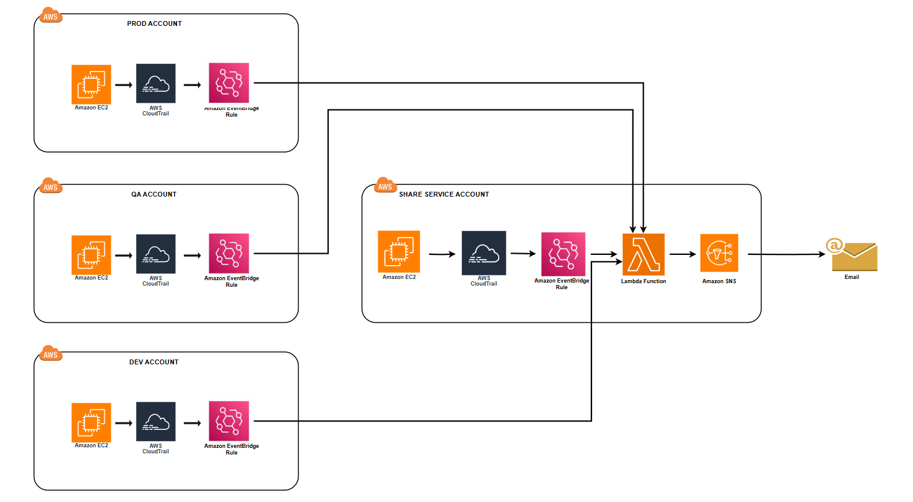

# AWS EC2 State Change Alerts

This project monitors EC2 instance state changes (such as launch, start, stop, reboot, and terminate) and triggers alerts via **SNS** using **AWS Lambda** and **CloudTrail**.

---

## Architecture Diagram

Below are the architecture diagrams for the EC2 state change alert system:

### Single Account Architecture


*Note: This sample implementation focuses on the single-account architecture.*

### Multi-Account Architecture



---

## Features

- Monitors EC2 state changes (launch, start, stop, reboot, terminate).  
- Sends notifications through **SNS** with details about the state change.  
- Configured using **EventBridge** to trigger on EC2 state changes captured by **CloudTrail**.

---

## Prerequisites

- AWS account  
- IAM roles with appropriate permissions for Lambda.
- Basic knowledge of AWS services such as IAM, EC2, Lambda, CloudTrail, SNS, and EventBridge  
- AWS CLI or Console for setup  

---

## Why These Services?

- **CloudTrail**: Provides event logs of AWS API calls, including EC2 state changes.  
- **EventBridge**: Allows near real-time event filtering and routing without needing to poll logs or S3 buckets.  
- **Lambda**: Serverless compute to process events and trigger notifications efficiently and scalably.  
- **SNS**: Managed pub/sub messaging service to distribute alerts via email, SMS, or other endpoints.

---

## Setup Instructions

### 1. **Create IAM Role for Lambda**

1. Go to the **IAM** console and click **Roles**.  
2. Click **Create Role** and select **AWS service**, then choose **Lambda**.  
3. Attach the following permissions policies:  
   - **AWSLambdaBasicExecutionRole**  
   - **AmazonSNSFullAccess**  
   - **AmazonEC2ReadOnlyAccess**  
4. Name the role (e.g., `Lambda-EC2StateChangeAlerts-Role`) and click **Create Role**.  
5. Assign this role to your Lambda function under **Configuration > Permissions**.

---

### 2. **Lambda Function**

Create the Lambda function to process EC2 state changes and send notifications via SNS:

1. Go to **AWS Lambda** and create a new Lambda function.  
2. Upload the Lambda code from this repository to handle EC2 state changes.  
3. Add appropriate permissions for Lambda to create lambda execution logs, describe EC2 instances, and publish to SNS.  
4. Set up the Lambda trigger to be the **EventBridge rule** you created.

---

### 3. **Create an SNS Topic**

Create an SNS topic to send alerts to a distribution list or endpoint:

1. Go to **SNS** in the AWS console.  
2. Create a new SNS topic and configure subscriptions (email, SMS, etc.).  
3. Ensure the Lambda function has permissions to publish messages to the SNS topic.

---

### 4. **Create an EventBridge Rule**

Set up an EventBridge rule to capture EC2 state change events from CloudTrail:

1. Go to **EventBridge** in the AWS console.  
2. Create a new rule to capture EC2 state changes:  
   - Select the **CloudTrail** event source.  
   - Filter the event patterns for EC2 state changes (RunInstances, StopInstances, StartInstances, RebootInstances, TerminateInstaces).  
   - Set the rule to trigger the Lambda function that processes the state change event.

---

### 5. **Configure CloudTrail**

Ensure CloudTrail is logging EC2 instance actions (RunInstances, StopInstances, StartInstances, RebootInstances, TerminateInstances):

1. Go to the **CloudTrail** service in the AWS console.  
2. Create a trail to record aws service events.  
3. Enable logging for **Management Events** and ensure **Read/Write events** are logged.  
4. Verify the CloudTrail event history includes EC2 instance state change events.

---

## Usage

Once the setup is complete, the EventBridge rule will automatically trigger the Lambda function when an EC2 instance's state changes (e.g., launched, started, stopped, rebooted, terminated). The Lambda function will send a notification via SNS, including the following details:

- Instance ID  
- Name tag (if available)  
- Instance type
- Platform (e.g., Linux, Windows)
- User who triggered the action  
- AWS account
- Region  
- Timestamp of the event

### Sample SNS Notification

```

EC2 Instance(s) Launched

Instance: i-0711a134e51977e5b
Name: Test Server
Type: t3.micro
Platform: Linux/UNIX


Initiated By: cloud_user
AWS Account: 339713094763
Region: us-east-1
Time: 2025-05-17T18:51:01Z UTC

```

---

## Cost Considerations

- **CloudTrail**: Free for management events but charges apply for data events and advanced features.  
- **EventBridge**: Charged per million events published and matched.  
- **Lambda**: Charged based on execution time and memory used.  
- **SNS**: Charged per published message and delivery type (email is generally free, SMS and mobile push incur costs).  

Costs are generally low for moderate usage but should be reviewed based on your account activity volume. Use the [AWS Pricing Calculator](https://calculator.aws/#/) for detailed estimates.

---

### AWS Service Costs Breakdown (Example Monthly Estimate)

| **Service**     | **Pricing Details**                                                               | **Example Monthly Usage**                          | **Estimated Monthly Cost** |
| --------------- | --------------------------------------------------------------------------------- | -------------------------------------------------- | -------------------------- |
| **CloudTrail**  | Management events free; S3 storage costs \$0.023/GB                               | 500 events → \~3 MB logs (\~0.003 GB) stored in S3 | \~\$0.00007                |
| **EventBridge** | \$1.00 per 1 million events published/matched                                     | 500 matched events                                 | \~\$0.0005                 |
| **Lambda**      | \$0.20 per 1 million requests (after free tier); compute \$0.0000166667/GB-s      | 500 invocations, 512 MB, 100 ms each               | \$0 (within free tier)     |
| **SNS**         | $0.50 per 1 million publishes after free tier; email delivery free | 500 email notifications                            | \$0                        |

**Estimated Total Monthly Cost: \~ \$0.0006**

---

## Enhancements (Future Improvements)

- **Detailed Notifications**: Include additional metadata, such as instance tags or cost estimation.  
- **Infrastructure as Code**: Provide CloudFormation or Terraform templates for automated setup.  

---

## References

- [AWS CloudTrail Documentation](https://docs.aws.amazon.com/cloudtrail/index.html)  
- [AWS EventBridge Documentation](https://docs.aws.amazon.com/eventbridge/latest/userguide/what-is-amazon-eventbridge.html)  
- [AWS Lambda Documentation](https://docs.aws.amazon.com/lambda/latest/dg/welcome.html)  
- [AWS SNS Documentation](https://docs.aws.amazon.com/sns/latest/dg/welcome.html)  
- [AWS Pricing Calculator](https://calculator.aws/#/)

---